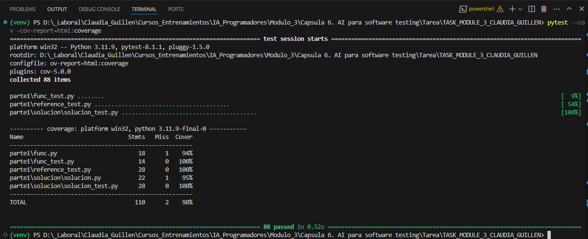

1. **Entender la Función**:
   Función es_primo()

Esta función está diseñada para determinar si un número es primo o no. Vamos a explicar cómo funciona:

Propósito: La función verifica si un número dado es primo. Un número primo es aquel que solo es divisible por 1 y por sí mismo.

Entrada: La función toma un único parámetro num, que es el número que queremos verificar si es primo o no.

Salida: Devuelve un valor booleano (True o False):

True si el número es primo
False si el número no es primo
Funcionamiento: La función utiliza un bucle for que revisa todos los números desde 2 hasta uno menos que el número ingresado. Para cada uno de estos números, verifica si son divisores del número original usando el operador módulo (%). Si encuentra algún divisor, significa que el número no es primo y devuelve False inmediatamente. Si completa todo el bucle sin encontrar divisores, devuelve True.

Flujo lógico:

Recibe un número
Intenta dividirlo por cada número entre 2 y el número-1
Si encuentra una división exacta (residuo 0), termina y dice que no es primo
Si prueba todas las divisiones y ninguna es exacta, dice que es primo
Por ejemplo, si ingresamos el número 7, la función probará dividirlo por 2, 3, 4, 5 y 6. Como ninguna de estas divisiones da un residuo de 0, la función determinará que 7 es primo y devolverá True.

1. **Validación de Números Primos Conocidos**:

   - La función debe identificar correctamente como primos los siguientes números: 2, 3, 5, 7, 11, 13, 17, 19, 23, 29, 31.
     

2. **Validación de Números No Primos Conocidos**:

   - La función debe identificar correctamente como no primos los siguientes números: 0, 1, 4, 6, 8, 9, 10, 12, 14, 15, 16, 18, 20.
     

3. **Manejo de Números Negativos**:

   - La función debe determinar que todos los números negativos no son primos. Esto incluye los números -1, -2, -3, -5, -11, -13.
     

4. **Eficiencia con Números Grandes**:

   - La función debe ser capaz de evaluar eficientemente la primalidad de números grandes, y determinar que 1000003 es primo y que 1000004 no es primo.
     

5. **Manejo de Entradas No Enteras**:

   - La función debe lanzar un error de tipo (`TypeError`) cuando se le pasan valores que no son enteros numéricos, como 2.3, 3.9, "tres", `None`, `True`, y `False`.
     

6. **Manejo de Inputs Inusuales**:
   - La función debe lanzar un error de tipo (`TypeError`) cuando se enfrenta a entradas inusuales como la cadena `"cinco"`, `None`, y listas vacías (`[]`).
     
7. **Precisión en Punto Flotante**:
   - La función debe ser capaz de manejar y aprobar como primos números de punto flotante que están extremadamente cerca de números primos enteros, como `19.000000000000004` y `23.000000000000004`, reconociendo su primalidad.
     

 
